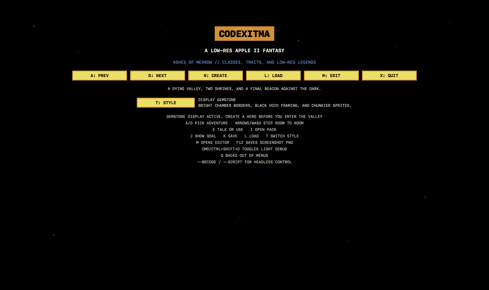
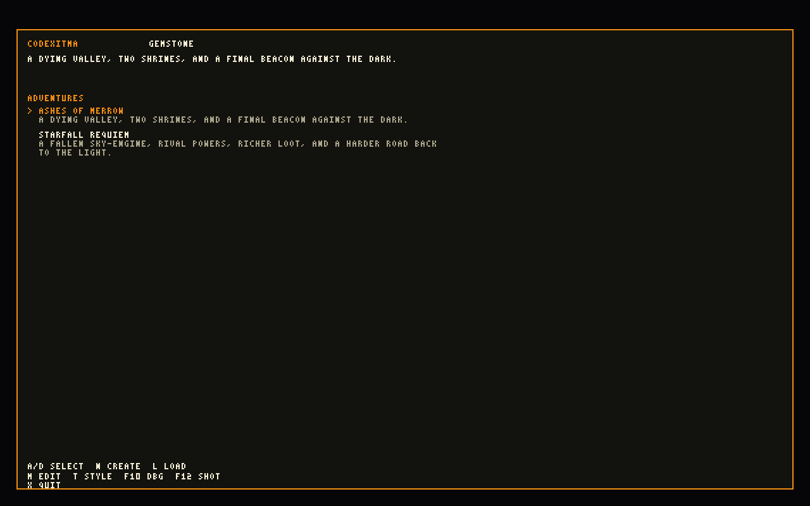
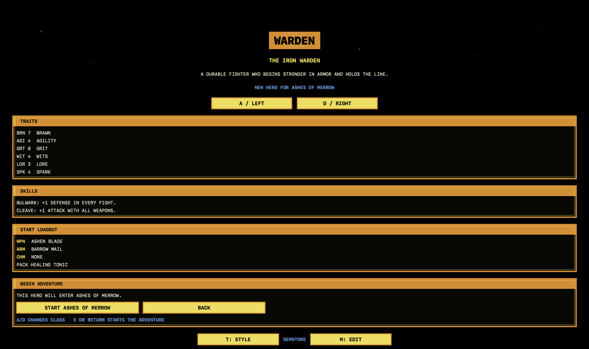
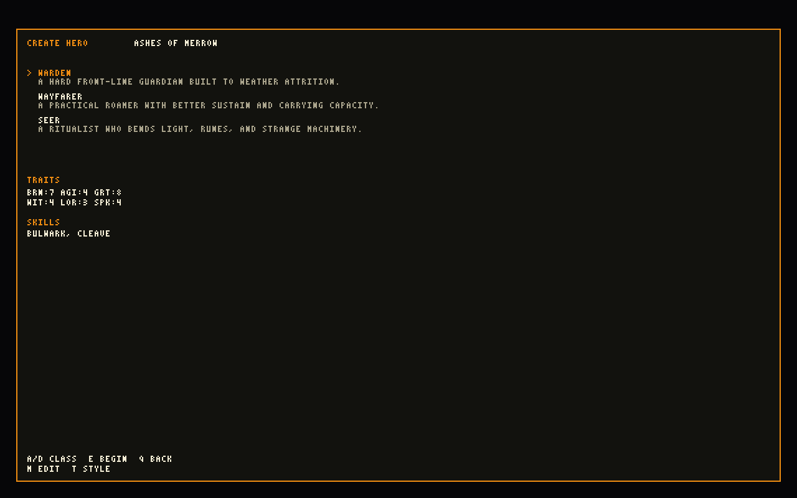
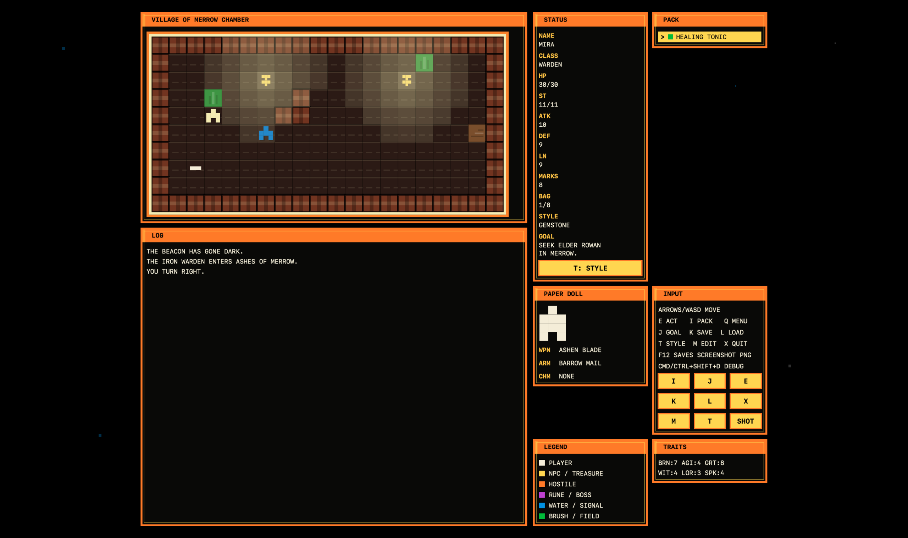
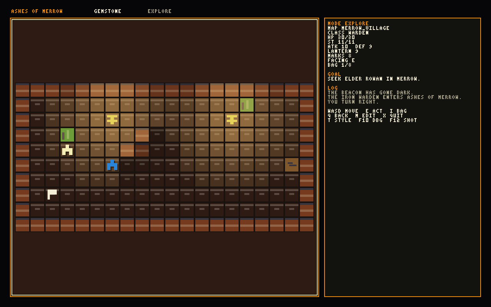
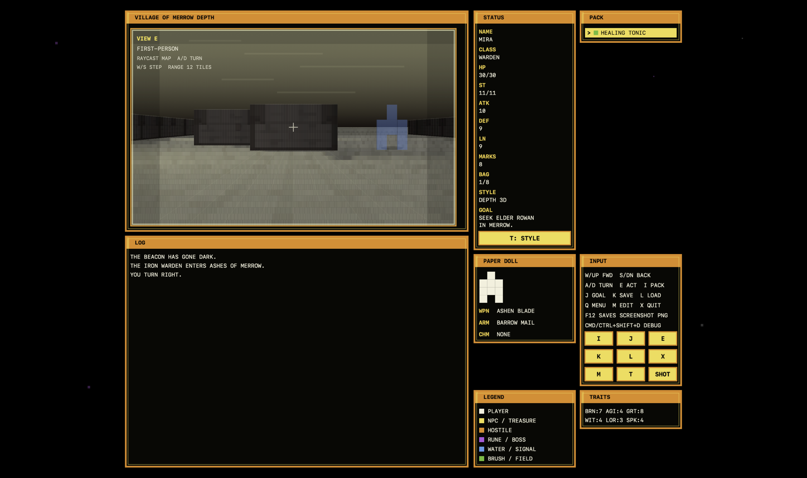
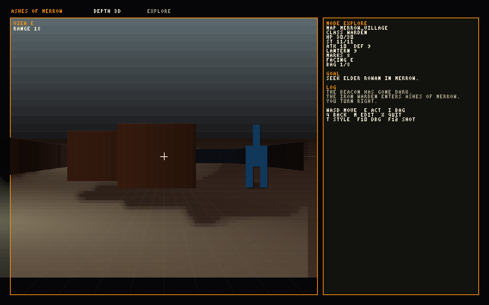

# Codexitma

Codexitma is a Swift 6 retro RPG engine with a native macOS frontend, a shipping SDL-based Win64 build, a built-in adventure editor, and a data-driven content pipeline.

It is deliberately styled after early Apple II and Ultima-era computer RPGs, with a modern codebase underneath: native graphics mode, an SDL cross-platform renderer, JSON content packs, deterministic automation hooks, and an in-game editor workflow.

## What It Is

- Graphics-first macOS RPG with low-resolution retro presentation
- Native AppKit/SwiftUI windowed mode on macOS
- SDL3 graphics frontend used for cross-platform rendering and the Win64 release build
- Three graphics styles on the same game state:
  - `Gemstone`
  - `Ultima`
  - `Depth 3D`
- Simple Apple II-style square-wave sounds in graphics mode
- Two playable adventures on the same engine
- Character creation with classes, traits, skills, starting gear, and inventory
- Built-in graphical adventure editor
- External JSON adventure packs and override mods
- Headless automation bridge for scripted runs and regression testing

## Current State

The project is beyond prototype status. The engine, save/load flow, combat, quests, exploration, shops, class-based hero starts, graphics themes, editor, external content loading, native macOS frontend, and Win64 SDL packaging are all working.

What is still evolving is depth and content scale:

- more authored encounters
- longer campaigns
- more systems depth
- more editor polish
- more visual refinement

The core engine and tooling are already real and usable.

Recent gameplay UX work also includes a real in-game pause/menu flow, so active runs can now safely resume, save back to title, abandon to title, or quit without closing the whole app just to switch adventures.

## Requirements

For local development:

- macOS 14 or newer
- Swift 6 toolchain (the package is set to Swift tools `6.3`)
- SDL3 installed locally if you want to run the SDL frontend on macOS (`brew install sdl3`)

For packaged builds:

- Tagged GitHub releases now include:
  - a macOS `.app` zip
  - a macOS CLI zip
  - a Win64 SDL zip

## Platform Support

- macOS
  - native AppKit/SwiftUI frontend is the primary shipping experience
  - SDL3 frontend is also available for parity testing with `--sdl`
- Windows
  - the supported packaged path is the Win64 SDL release artifact
- Linux
  - the SDL frontend is the intended future path, but packaged Linux releases are not published yet

## Quick Start

Build and run the default graphics mode:

```sh
swift run Game
```

Launch directly into the graphical editor:

```sh
swift run Game --editor
```

Run the SDL frontend on macOS for cross-platform parity testing:

```sh
swift run Game --sdl
```

After successful builds, a convenience copy of the latest working binary is also kept at the repo root:

```sh
./Codexitma
```

## Gameplay Features

- Tile-based top-down exploration
- Turn-based movement and combat
- Dialogue and NPC interaction
- Inventory, consumables, gear, and equippable slots
- Shops and `marks` currency
- Environmental puzzle gates
- Adventure selection from the title screen
- Save/load support
- Persistent graphics theme preference between launches

## Graphics Modes

`Codexitma` supports three visual themes in graphics mode. They all run on the same underlying engine state.

- `Gemstone`
  - high-contrast chamber look inspired by early action-RPG screens
- `Ultima`
  - flatter overworld-style board with stricter classic field readability
- `Depth 3D`
  - first-person raycast dungeon view with turn-in-place controls and map-accurate depth
  - authored map backdrops (`sky` vs `ceiling`) for outdoor/indoor depth scenes
  - shared world-space lighting/shadow field across floor, walls, and ceiling
  - sky backdrop contributes emissive ambient light; torches and features cast occlusion-aware shadows

In graphics mode, press `T` to cycle styles.

On macOS, the native frontend is still the default. The SDL frontend is the cross-platform path and is what the Win64 release build uses.

## Screenshots

Each row below shows the same gameplay moment in both editions:

- left: native macOS renderer
- right: SDL Win64 renderer

| Scene | Native macOS | SDL Win64 |
| --- | --- | --- |
| Title screen |  |  |
| Character creator (Warden) |  |  |
| Ashes of Merrow: Merrow Village exploration (view A) |  |  |
| Ashes of Merrow: Merrow Village exploration (view B) |  |  |

## Controls

### General

- `WASD` or arrow keys: move
- `E` or `Space`: interact / confirm
- `I`: open inventory / leave inventory / leave shop
- `J` or `H`: show objective / inspect selected entry
- `K`: save
- `L`: load
- `Q`: cancel / back, or open the pause menu during live gameplay
- `X`: quit
- `T`: cycle graphics theme
- `M`: open the editor (graphics mode)
- `F12`: save a framebuffer screenshot (`.png` in native and SDL modes)
- `Cmd/Ctrl+Shift+D`: toggle native lighting debug overlay
- `F10`: toggle SDL lighting debug overlay

### Pause Menu

Press `Q` during a live run to open the pause menu.

Pause options:

- `Resume`
- `Save + Title`
- `Title Without Save`
- `Quit Game`

### Depth 3D

When `Depth 3D` is active during exploration:

- `W` / Up: move forward
- `S` / Down: step backward
- `A`: turn left
- `D`: turn right

### Shops

- movement keys: change selected offer
- `E`: buy selected offer
- `J`: inspect selected offer
- `Q` or `I`: leave the counter

## Included Adventures

- `Ashes of Merrow`
  - the original dark-valley beacon restoration campaign
- `Starfall Requiem`
  - a larger salvage-coast adventure with a hub town, stores, dungeons, and a late-game sky-engine path

Choose the active adventure on the title screen before starting a new character.

## Built-In Editor

The graphical editor is a first-class part of the app, not just a dev-only tool.

You can open it in three ways:

- `swift run Game --editor`
- `M` from the title screen
- `M` during a live adventure, followed by confirmation

Current editor capabilities:

- create a blank template adventure
- load bundled adventures for safe override editing
- reopen and edit external user packs
- paint terrain on maps
- place NPCs, enemies, interactables, portals, and spawn points
- edit dialogue, quest flow, encounters, shops, NPCs, and enemies
- validate content before export
- export and immediately playtest the active pack

Bundled adventures are never edited in-place. Editing a bundled adventure writes an external override pack instead.

See [EDITOR_ROADMAP.md](EDITOR_ROADMAP.md) for the editor-specific notes and remaining polish targets.

## Content Packs And Mods

Most authored content is now externalized into JSON rather than hardcoded in Swift.

Bundled data lives under:

- `Sources/Game/ContentData`
- `Sources/Game/ContentData/adventures/ashes_of_merrow`
- `Sources/Game/ContentData/adventures/starfall_requiem`

This includes:

- adventure metadata
- hero templates
- item definitions
- objective flow
- dialogue
- encounters
- NPCs
- enemies
- shops
- map layouts
- map backdrop metadata (`depthBackdrop`: `sky` or `ceiling`) for `Depth 3D`

External adventure packs are loaded from:

- macOS:
  - `~/Library/Application Support/Codexitma/Adventures`
- Windows (portable default):
  - `<folder next to Codexitma.exe>/CodexitmaData/Adventures`
  - if that folder is not writable, fallback is `%APPDATA%\\Codexitma\\Adventures`

Each pack lives in its own folder and provides the same JSON-driven content structure.

For map JSON, `depthBackdrop` controls depth-mode backdrop and ambient behavior:

- `sky`: outdoor backdrop with sky emissive ambient
- `ceiling`: indoor backdrop with shaded ceiling projection

If an external pack uses the same adventure `id` as a bundled adventure, it overrides the bundled one. That is the supported mod path for changing shipped adventures without touching the app bundle.

Graphics tile/sprite palettes and map theme overrides can also be modded without recompiling Swift by creating:

- macOS:
  - `~/Library/Application Support/Codexitma/graphics_assets.json`
- Windows:
  - `<folder next to Codexitma.exe>/CodexitmaData/graphics_assets.json`
  - fallback: `%APPDATA%\\Codexitma\\graphics_assets.json`

An example schema and default pack lives at:

- `Sources/Game/ContentData/graphics_assets.json`

## Automation And Testing

Codexitma includes a built-in headless control surface for scripted play and regression testing.

Examples:

```sh
swift run Game --script "new,e,state"
swift run Game --script "right,new,e,state"
swift run Game --script "new,e,warp:merrow_village:10:5:w,state"
swift run Game --script-file path/to/commands.txt --step-json
swift run Game --bridge
```

The bridge is the preferred automation surface. If an MCP server is added later, it should wrap this interface instead of duplicating game logic.

See [AUTOMATION.md](AUTOMATION.md) for details.

## Releases

Tagged releases are now built through GitHub Actions and published with platform artifacts.

- `Windows SDL Build`
  - runs on Windows runners
  - produces the Win64 SDL package
- `macOS Package Build`
  - runs on macOS runners
  - produces the macOS app and CLI zips

These packaging workflows no longer run on every `main` push. They run on:

- manual dispatch
- version tags matching `v*`

That keeps routine development pushes cheap while still allowing reproducible release builds.

To mirror a published GitHub release back into the local ignored `dist/` folder, run:

```sh
./scripts/sync_release_to_dist.sh v0.2.3
```

If you omit the tag, the script pulls the latest published release.

## Repository Notes

- [PLAN.md](PLAN.md) contains the original project plan and is now preserved as a historical baseline rather than an exact description of the current implementation.
- [SCRATCHPAD.md](SCRATCHPAD.md) is the running development notebook.
- `main` is the canonical development branch.

## Development

Run the test suite:

```sh
swift test
```

The project is organized as a Swift Package with:

- executable target: `Game`
- test target: `GameTests`

To create a release build through GitHub Actions, tag the release commit with a version tag such as `v0.2.3` and push the tag.

## Road Ahead

The current priorities are straightforward:

- expand adventure content
- deepen systems for replayability
- keep refining the editor
- continue improving the retro visual presentation without breaking the low-resolution design goal
